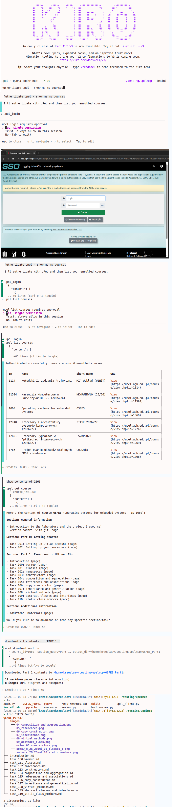

# UPeL AGH MCP Server & Skill

A Model Context Protocol (MCP) server and agent skill for interacting with AGH University's UPeL learning platform (Moodle).

Designed with strict **separation of concerns**:
- **MCP Server:** Read-only access to UPeL (queries courses, sections, task pages, and resources). Zero local filesystem writing.
- **Agent:** Handles local workspace file creation explicitly using its native file-writing tools.

---

## 1. Quick Install

Clone the repository and run the interactive installer:

```bash
git clone https://github.com/mszczesniak02/upelmcp.git
cd upelmcp
./install.sh
```

### What `install.sh` does:
1. Creates an isolated Python virtual environment inside the repo (`./pyenv`).
2. Installs dependencies (`mcp<2`, `httpx`, `beautifulsoup4`, `playwright`).
3. Installs Playwright Chromium.
4. **Prompts you to select your agent:**
   - **Antigravity / Gemini CLI** (`~/.gemini/config/skills/upel/`, `~/.gemini/config/mcp_config.json`)
   - **Claude Desktop** (`claude_desktop_config.json`)
   - **Cursor** (`~/.cursor/mcp.json`)
   - **Kiro / kiro-chat** (`~/.kiro/settings/mcp.json`, `~/.kiro/agents/upel.json`)
   - **Workspace local** (`.agent/skills/upel/`)
   - **All supported agents**
5. Installs the **skill only** to the selected agent's skills directory.
6. Configures the MCP server to invoke the Python virtual environment located inside the cloned repository directory.

---

## Recommended: Kiro CLI

For users who do not already have an AI agent configured, **[Kiro CLI](https://kiro.dev)** is the recommended standalone client. It works seamlessly out of the box on the free tier using standard lightweight models, offering a fast, responsive, and distraction-free terminal workflow.

Selecting Kiro during `./install.sh` automatically registers a dedicated agent profile at `~/.kiro/agents/upel.json` with all necessary MCP tool bindings. Once installed, simply launch the assistant:

```bash
kiro-cli --agent upel
```



---

## 2. Authentication

Authenticate once via AGH SSO:

```bash
./pyenv/bin/python auth.py
```

- A browser window opens to `https://upel.agh.edu.pl/my/courses.php`.
- Complete your AGH SSO / 2FA login.
- Once authenticated, the `MoodleSession` cookie is stored in `.session` with strict `0600` permissions.

> [!IMPORTANT]
> **Security & Responsibility:** This tool uses your own AGH SSO session and operates strictly with your existing UPeL permissions. Never share your `.session` file or AGH session cookies with anyone. You are responsible for ensuring that your use of this tool complies with the rules and regulations applicable to your AGH account.

*Note:* If you skip this step, the agent will automatically detect that no active session exists on its first run and trigger the login window for you.

---

## 3. Available MCP Tools (Strictly Read-Only)

| Tool | Parameters | Description |
|---|---|---|
| `upel_check_session` | *None* | Verifies if current session is active; returns user name. |
| `upel_login` | *None* | Launches browser window to authenticate / refresh session. |
| `upel_list_courses` | *None* | Lists all enrolled courses with IDs, titles, and URLs. |
| `upel_get_course` | `course_id: int` | Returns course sections, activities, and task page IDs. |
| `upel_get_page` | `page_id_or_url: str` | Reads task content, markdown text, suggested underscore filename, and image URLs into memory. |
| `upel_get_assignment` | `assignment_id: int` | Reads assignment instructions, deadline, and submission status. |
| `upel_read_file` | `file_url: str` | Reads remote file/attachment into memory as base64 without writing to disk. |

---

## 4. Agentic Workflow

When working with your AI assistant:

1. **Automatic Auth Check:**
   The agent automatically calls `upel_check_session` at the start of any UPeL interaction. If unauthenticated, it opens the SSO login window via `upel_login`.
2. **Course Selection:**
   The agent lists enrolled courses cleanly by name with numbers (no links), e.g.:
   ```text
   1. [1060] Operating systems for embedded systems
   2. [1114] Metodyki Zarządzania Projektami
   3. [11584] Narzędzia Komputerowe w Rozwiązywaniu ...
   ```
3. **Course Inspection:**
   The user selects a course, and the agent lists its sections, exercises, and tasks.
4. **Saving Content:**
   - The agent asks where to save the files, suggesting by default a folder named after the course with underscores:
     `./<course_name_with_underscores>/` (e.g. `./operating_systems_for_embedded_systems/`).
   - The agent fetches task contents into memory and uses its native file-writing tools to save `.md` files without spaces in filenames (e.g. `task_100_warmup.md`).
   - Embedded diagrams are placed under `<dest_dir>/images/`.

---

## Disclaimer

> [!CAUTION]
> **Use at your own risk.**

This project is an unofficial, community-developed tool for interacting with the AGH UPeL platform. It is not affiliated with, endorsed by, or supported by AGH University of Krakow (*Akademia Górniczo-Hutnicza im. Stanisława Staszica w Krakowie*). All trademarks, service marks, and institution names ("AGH", "UPeL", "Moodle") belong to their respective holders and are referenced strictly for identification and descriptive purposes. Their use does not imply any affiliation, sponsorship, or endorsement.

The software automates access to UPeL using the authenticated user's own AGH account and permissions. It does not provide access to data or materials that the user could not access through UPeL normally.

By using this software, you are responsible for:
- Complying with AGH's regulations, policies, and terms applicable to your account and use of UPeL;
- Using the software only with an account you are authorized to use;
- Protecting your AGH credentials, session cookies, and `.session` data;
- Ensuring that your use of the software does not adversely affect, disrupt, or overload UPeL or other users;
- Complying with applicable laws and regulations.

The author and contributors are not responsible for any consequences resulting from the use, misuse, modification, or unavailability of this software, including account restrictions, loss of access, data loss, or other consequences arising from the user's use of the software.

The project is provided **"as is"**, without guarantees regarding continued compatibility with UPeL. UPeL may change its authentication, API, website structure, or other functionality at any time, which may cause this software to stop working.

Do not use this software to bypass authentication, access controls, rate limits, or other security mechanisms.

---

## License

This project is licensed under the [MIT License](LICENSE).
